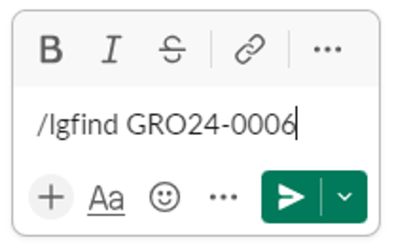

# LIMS-Search-Slack-App
## Introduction
Python project for two Lambda functions powering a Slack application that can directly query locations of stocks in our 
Lab Information Management System (LIMS)

At GRO Biosciences, we use the website LabGuru for our LIMS (Lab Information Management System) to store collection item (Strains, Plasmids, Synthetic DNA, 
etc.) information along with associated stocks with listed locations. The company's shared collection item stocks have
physical locations reflected in the LIMS stock information.

This code repository is for two Lambda functions that power a Slack slash command that quickly returns a collection 
item's physical location as a Slack message. Searching the LIMS can be done on LabGuru's website, but with all user's
running Slack at all times, the Slack slash command offers a speedier, hassle-free option for locating stocks.

The Lambda functions each have a unique purpose and work in sequence:
- AuthandResponse - Confirms that the Slack request is coming from someone in our company's Slack Workspace. Upon confirmation,
AuthandResonse relays the search payload to the next Lambda function, LIMSQuery, and sends a 200 OK response back to Slack.
Slack requires a 200 response within 3s, or an error message appears in Slack.
- LIMSQuery - Parses the search payload for collection item names and queries the LIMS for collection items and stocks.
If the appropriate stocks are located in the LIMS, the location information and associate links are direct messaged to 
the user. The query is logged in an RDS for usage tracking and debugging.

## Slack View and Function
A Slack slash command can be initiated from any Slack message box. Upon hitting send, the search will be initiated and 
the user will see an ephemeral message. That ephemeral message is only visible by the user that sent the slash command,
so do not worry about sending the command into a channel with other people.

The ephemeral message comes from the AuthandResponse Lambda function acknowledging the slash command and preventing a 
Slack error message. The search payload is bolded in a direct message to the user as an echo. This is helpful if there are
obvious typos that the user can identify right away. The below example is a screenshot of the LGSearch direct message page.

Once appropriate stocks are found, the location information, along with hyperlinks, replaces the echo message to the user.
In this example, GRO24-0006 did not exist in the LIMS, but the LIMSQuery function iterated through all possible year codes
to check if there was a typo in the original search. GRO17-0006 did provide a hit, so that strain's shared stock location
was sent back to the user. The shared stock location for a strain is determined to be boxes with the prefix "AGS" or "GLY".
Strains can have dozens of different stocks in the LIMS, but LIMSQuery sifts through all stocks to return the shared locations.

## AWS Serverless Architecture and Resources
For this Slack slash command, I used a very simple serverless architecture with two sequential Lambda functions. This simple
design allowed for rapid deployment and is the easiest AWS method for building a Slack app.

As described previously, the reason for having two sequential Lambda functions rather than a single Lambda function is the
LIMSQuery function takes longer than 3s to run, and Slack needs a status 200 response within 3s of the slash command starting.
